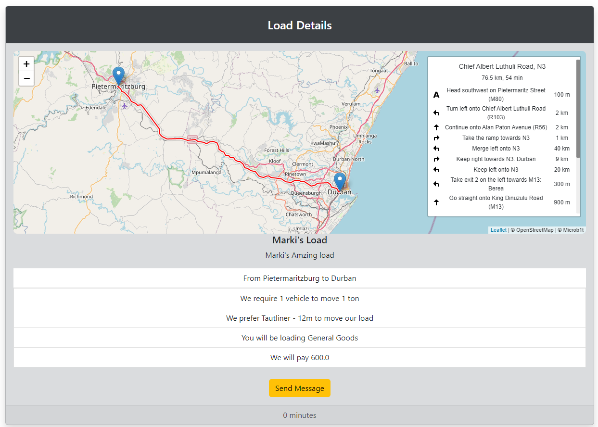

# LOADY - Python/Django Load posting app

## Description

This is my first Django app, and I had to do alot of research to get this done.

The app allows users to come to the site register for a new account and post loads they need transported, and transporters can come and see loads that are available and speak directly to the their clients. 

I will be writting a new version of this that I will deploy to Heroku as this was purely a test to see not only what Django is capable of but to also test my self if I would be able a do a project like this. This project is not done, but it is in a working state. I saw what I would like to impove and will be starting with LOADY v2, within this week.

## Features 
- Direct Messaging
- Viewing of posted loads
- Detail view of posted load with a leaflet map integration
- Leaflet routing machine integration
- Update your own profile and company details
- Login and Register System
- Bootsrap5

## How to Use/Run

This was writen in Python 3.10 and Django 4, you can view the requirements.txt file for all libraries used.
You will have to add your SECRET_KEY to the .env
You are welcome to mail me with further queries about this package.

### Additional modules needed

- See requirements.txt
- (rest_framework was not used was planning on only working on the API and doing a front end with React)

### Screenshots

  

  
